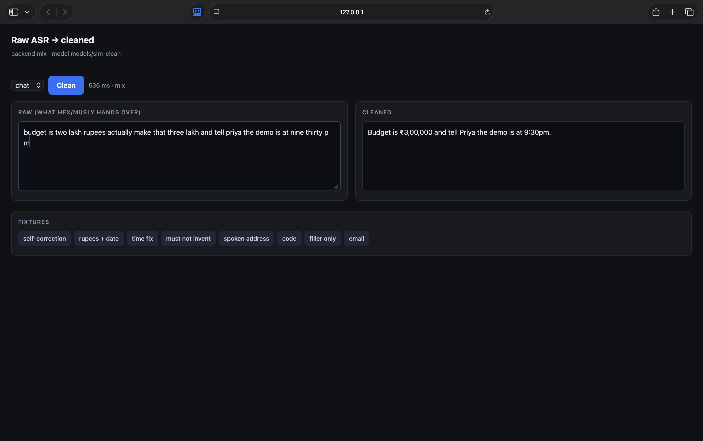
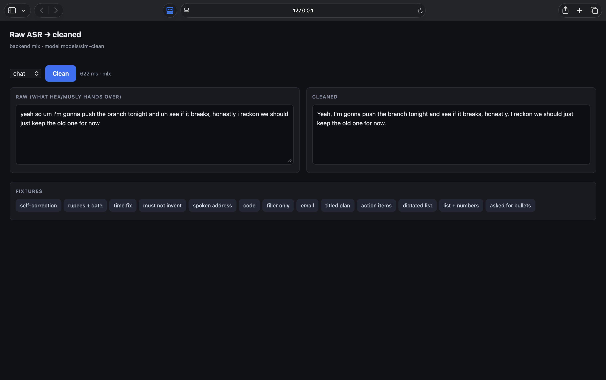
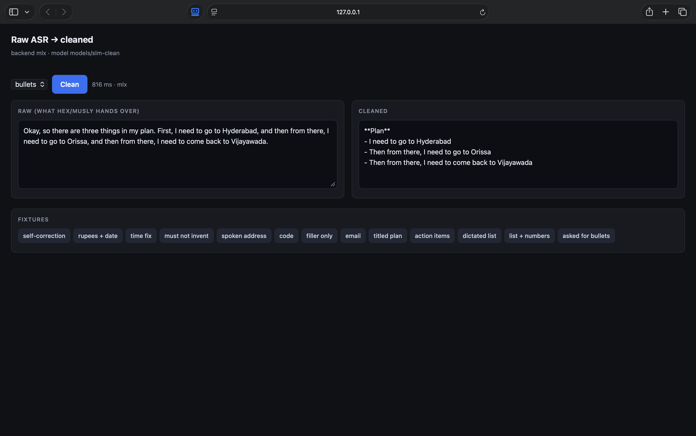

# SLM after Hex / Musly

**Branch:** `vibe/slm` · **Brief:** [../../briefs/05-slm-asr-postprocess.md](../../briefs/05-slm-asr-postprocess.md)

A 0.6B model, fine-tuned on this Mac, that turns raw speech-to-text into text you
can actually send. It runs behind one endpoint — `POST /v1/clean` — so Hex,
Musly or anything else can call it after ASR.

**Where it landed:** 30/30 on the held-out fixtures on both backends, ~340 ms
per utterance on an M-series Mac, ~134 ms and 424 MB as a Q5 GGUF. No cloud, no
API key.



It cleans without flattening you: `gonna` stays `gonna`, "I need to" stays "I
need to", and nothing gets summarised.



It also restructures a dictated list,
which is the thing Hex will not do — it hands back one paragraph no matter how
clearly you enumerated. If you name the list out loud ("three things in **my
plan**"), the name becomes the title:



## The before/after

These 30 lines are held out of training and frozen in `data/fixtures.jsonl`.
Regenerate the table with `scripts/eval_fixtures.py`; full run in
[results/fixtures-mlx.md](results/fixtures-mlx.md).

| raw (what ASR hands over) | cleaned |
|---|---|
| so um send it to rahul no wait rohan | Send it to Rohan. |
| the invoice came to twenty thousand rupees and it's due on march third twenty twenty six | The invoice came to ₹20,000 and it's due on March 3, 2026. |
| let's meet at nine a m sorry ten thirty | Let's meet at 10:30. |
| uh mail priya about the delay | Mail Priya about the delay. |
| ping shaurya on whatsapp he has the keys | Ping Shaurya on WhatsApp. He has the keys. |
| run git checkout dash b vibe slash slm | run git checkout -b vibe/slm |
| um the endpoint is post slash v one slash clean | the endpoint is POST /v1/clean |
| we need i mean twelve boxes no sorry fifteen | We need 15 boxes. |
| the wearable has to stay under fifteen hundred rupees per animal | The wearable has to stay under ₹1,500 per animal. |
| um uh like you know | *(empty)* |
| send the deck to ananya at skan dot ai before the call | Send the deck to ananya@skan.ai before the call. |
| the the build is green we can we can ship after lunch | The build is green. We can ship after lunch. |
| budget is two lakh rupees actually make that three lakh | Budget is ₹3,00,000. |
| hey vikram just wanted to check if the devnet token moved thanks meera | Hi Vikram,<br><br>Just wanted to check if the devnet token moved.<br><br>Thanks,<br>Meera |
| can you check whether the barometer picked up the third floor | Can you check whether the barometer picked up the third floor? |
| call clean underscore transcript with temperature zero | call clean_transcript with temperature 0 |
| laptops close at eight then we make gin then dinner | Laptops close at 8, then we make gin, then dinner. |
| assign it to karthik no actually divya she has context | Assign it to Divya. She has context. |
| the spend cap refused it which is uh exactly what we wanted | The spend cap refused it, which is exactly what we wanted. |
| call nikhil and tell him the demo is at nine thirty p m | Call Nikhil and tell him the demo is at 9:30pm. |

And in `bullets` style:

| raw | cleaned |
|---|---|
| Okay, so there are three things in **my plan**. First, I need to go to Hyderabad, and then from there, I need to go to Orissa, and then from there, I need to come back to Vijayawada. | **Plan**<br>- I need to go to Hyderabad<br>- Then from there, I need to go to Orissa<br>- Then from there, I need to come back to Vijayawada |
| action items from the standup first review the pull request second update the roadmap and third pay the vendor | **Action Items**<br>- Review the pull request<br>- Update the roadmap<br>- Pay the vendor |
| um so there are three points first confirm the venue second charge the laptops and third order the sensors | - Confirm the venue<br>- Charge the laptops<br>- Order the sensors |
| So, okay, so okay, let's. I'm just testing this. So, there are three points first, go to Hyderabad, second, go to Bhoneswar, and third, I need to go to Delhi. | - I'm just testing this<br>- Go to Hyderabad<br>- Go to Bhoneswar<br>- I need to go to Delhi |
| okay so three things first pay rohan twenty thousand rupees second the call is at nine thirty p m and third book the ticket to chennai | - Pay Rohan ₹20,000<br>- The call is at 9:30pm<br>- Book the ticket to Chennai |
| we need to finish the deck and then review the pull request also update the roadmap | - We need to finish the deck<br>- Then review the pull request<br>- Also update the roadmap |
| *(chat style)* make this bullet points um first charge the laptops second confirm the venue and third order the sensors | - Charge the laptops<br>- Confirm the venue<br>- Order the sensors |
| *(chat style)* so there are two points first call the landlord and second pay the vendor | First, call the landlord. Second, pay the vendor. |

Four things are deliberate here. **Naming the list gives it a title** — "in my
plan" produces `**Plan**`, while "there are three points" names nothing and gets
no title, because inventing one is inventing content. **`Bhoneswar` is left
exactly as spoken**; the model fixes structure, not proper nouns, and guessing
"Bhubaneswar" is the same class of mistake as guessing an email address. The
last two rows are the pair that keeps `chat` predictable: asking for bullets out
loud produces a list, but merely *enumerating* something does not.

And **each bullet is still the speaker's own clause**. "I need to come back to
Vijayawada" does not become "Come back to Vijayawada", which is why the third
row of the `Bhoneswar` example reads `- I need to go to Delhi` while the two
above it, which were dictated bare, read `- Go to Hyderabad`. The model mirrors
the speaker item by item instead of forcing all of them into one shape. An
earlier version flattened everything to imperatives and stamped "Then from
there," onto every line; it passed the fixtures and still read like a form
letter. [PRESERVE.md](PRESERVE.md) has the full contract.

The `mail priya` row above is the one worth stopping on. `mail priya` stays `Mail Priya` —
the model is not allowed to guess an email address, and if it ever does,
[the guard](PRESERVE.md#the-guard) strips it and says so. Read
[PRESERVE.md](PRESERVE.md) before you change anything about the output format.

## Run it

```bash
cd vibes/slm
uv venv --python 3.13 .venv
uv pip install --python .venv/bin/python datasets mlx-lm fastapi uvicorn httpx pytest

.venv/bin/python -m uvicorn server.app:app --port 8742
open http://127.0.0.1:8742
```

```bash
curl -X POST localhost:8742/v1/clean \
  -H 'Content-Type: application/json' \
  -d '{"text":"so um send it to rahul no wait rohan","style":"chat"}'
```

```json
{
  "raw": "so um send it to rahul no wait rohan",
  "cleaned": "Send it to Rohan.",
  "violations": [],
  "latency_ms": 321,
  "backend": "mlx",
  "model": "models/slm-clean"
}
```

`style` is `chat`, `bullets`, `email` or `code`. Anything else falls back to
`chat`. `violations` is what the guard refused to let through.

To run it on the Windows laptop, see [docs/WINDOWS.md](docs/WINDOWS.md) — same
API, same weights as a Q4 GGUF through llama.cpp, no MLX.

To call it from Hex after every dictation, see [docs/HEX.md](docs/HEX.md) — two
files, seven lines, and it fails open if the sidecar is not running.

## Rebuild it from scratch

```bash
.venv/bin/python scripts/gen_synthetic.py     # our pairs -> data/synthetic/
.venv/bin/python scripts/build_dataset.py     # + public corpora -> data/processed/
./scripts/train_mlx.sh                        # LoRA + fuse, ~25 min on an M-series
.venv/bin/python scripts/eval_fixtures.py     # the table above
.venv/bin/python -m pytest tests -q           # the guard
```

## What it is made of

**Base:** [Qwen3-0.6B](https://huggingface.co/Qwen/Qwen3-0.6B), LoRA on 16 layers
(2.9M trainable params, 0.48% of the model), fused back into a single
`models/slm-clean`. Validation loss 3.23 → 0.17 over 4,900 iterations.

**Data** (~24k pairs, `data/processed/`):

| Source | Pairs | What it teaches |
|---|---:|---|
| [disfl_qa](https://huggingface.co/datasets/google-research-datasets/disfl_qa) | 4,000 | "no wait" style self-corrections |
| [nyralabs/disfluency_speech_english](https://huggingface.co/datasets/nyralabs/disfluency_speech_english) | 3,000 | real spoken fillers and cutoffs |
| [shantanugoel/aawaaz-transcript-cleanup](https://huggingface.co/datasets/shantanugoel/aawaaz-transcript-cleanup-dataset) (MIT) | 258 | dictated paragraph → titled markdown list |
| `data/synthetic/synthetic.jsonl` (ours, committed) | 17,427 | rupees, Indian names, times, code, PRESERVE, enumerated and titled lists, casual register |

The public corpora are American telephone speech — plenty of "um", zero rupees
and nothing that punishes a model for inventing an email address. Those cases
are exactly what we demo, so `scripts/gen_synthetic.py` writes them. It is a
seeded generator, so the data is reproducible without committing a blob.

`aawaaz` is the only public dataset we found that *restructures* a spoken
paragraph into a list, but most of it quietly summarises while doing so — "we go
through two gallons a week with the kids" comes out as `- Milk — 2 gallons`.
That is a different task, and training on it is what first taught our model to
answer in clipped, voiceless imperatives. `build_dataset.py` now scores every
pair on how much of the speaker survives it and keeps only the faithful ones,
which is 129 of ~1,950 rows. Its headings also come in three spellings
(`**Produce:**`, `Produce:`, bare bullets) and are normalised to our
`**Produce**`, otherwise the model learns three formats and picks one at random.

Only the transcript columns of the nyralabs parquet are read, via column
pruning, so the ~1 GB of audio never lands on disk.

## Things that will bite you

**Qwen3's chat template injects an empty `<think>` block into the assistant
turn during training.** At inference you must pass `enable_thinking=False` or
the prompt no longer matches what the model was trained on and the output falls
apart. Both backends in `server/backends.py` already do this.

**Do not use "i mean" as a filler.** It is also a correction cue. Training on it
both ways taught the model to ignore corrections and cost us a fixture.

**Every style needs its negative case.** Adding `bullets` was not enough: until
we also trained "enumerated sentence in `chat` style stays prose", the model
started turning ordinary sentences into lists. Same for titles — without
"unnamed list gets no title", it began inventing one.

**Adding data dilutes what is already there.** Folding in 2,000 list rows
knocked out the spoken-email fixture, because only 52 of 22,000 pairs taught
`ananya at skan dot ai` → `ananya@skan.ai`. Enumerating that case properly
(296 pairs) fixed it. Re-run `eval_fixtures.py` after every data change.

**Fixtures do not measure tone.** Exact-match scoring said 28/28 while the model
was answering in flat, voiceless imperatives — because we had written the
targets that way ourselves, so it was scoring our own bad taste. Two habits
caused it: templating a fixed prefix onto generated list items, and training on
public list data that summarises. Read a sample of your targets out loud before
you train on 20,000 of them.

**A word cannot be a filler in one example and content in another.** `so` is a
filler everywhere, so a tone pair that kept it taught the model to guess, and it
guessed wrong — it returned "So, I'm gonna…" and dropped the "Yeah". Stance
words (`yeah`, `nah`, `honestly`) are content and always kept; fillers are
always dropped. Spell out the collision — `yeah so` → `Yeah,` — or the model
never learns which one wins.

**Q4 costs you a fixture here.** The Q4_K_M export dropped the email sign-off
(29/30) where Q5_K_M holds at 30/30 for 46 MB more. Quantise, then re-run the
fixtures against the GGUF — do not assume the MLX score transfers.

**Weights are gitignored.** `models/`, `adapters/`, `*.gguf` and `data/raw/`
stay local. Rebuild them with the commands above.

## Layout

```
data/fixtures.jsonl       30 held-out cases, committed
data/synthetic/           our pairs, committed
data/processed/           built, gitignored
scripts/style.py          the system prompt, shared by training and serving
scripts/gen_synthetic.py  the India/code/PRESERVE generator
scripts/build_dataset.py  merge + split
scripts/train_mlx.sh      LoRA + fuse
scripts/eval_fixtures.py  the before/after table
server/app.py             POST /v1/clean
server/backends.py        mlx (Mac) | llamacpp (Windows)
server/guard.py           the PRESERVE guard
tests/test_guard.py       11 cases the guard must never fail
dist/                     GGUF exports, gitignored
PRESERVE.md               what it may and may not change
docs/WINDOWS.md           running the same model on the Windows laptop
docs/HEX.md               the Hex patch (Hex is cloned next to this repo)
```
